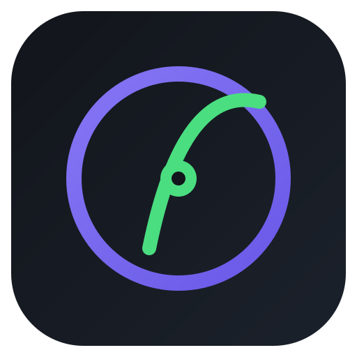

<div align="center">



# 象限先生的数学实验室

**初高中数学可视化交互实验：实时图像仿真 · 可调参数 · 公式推导 · 实验指南**

[Next.js](https://nextjs.org) · [TypeScript](https://www.typescriptlang.org) · [KaTeX](https://katex.org) · 自研 Canvas 绘图引擎

</div>

---

## ✨ 这是什么

仿照「[粒子先生的物理实验室](https://liziwuli.com/)」（高中物理可视化交互实验站）构建的数学方向版本：把抽象的数学概念变成**可拖动、可调参、可实时观察**的画布实验。

## 🧪 实验一：函数图像与导数探究

- **表达式输入**：安全解析器支持 `x`、参数 `a b c d`、`sin cos ln sqrt ^` 等，非法输入即时中文提示（并保留上一条有效曲线）
- **7 组预设函数卡**：二次 / 三次 / 正弦 / 指数 / 对数 / 反比例 / 阻尼振荡，每组自带推导公式与易错点
- **参数滑块**：a/b/c/d 实时联动图像
- **切线**：拖动切点，切线斜率 = 瞬时变化率实时显示
- **导数曲线**：f′(x) 与 f(x) 同屏对比（解析导数优先，数值微分兜底）
- **定积分面积**：区间可调，黎曼和中点法 + 有向面积语义
- **KaTeX 公式推导**：公式卡 / 实验指南 / 易错点三面板 + **🎯 挑战模式**（小目标自动判分、进度持久化）
- **学段门控**：初中模式自动降级为「割线 + 平均变化率」并隐藏导数内容，预设标注 ⭐高中进阶
- **画布信息层**：切点数值芯片（x₀/f(x₀)/斜率）、悬停切线预览、零点与极值点自动标注、曲线辉光
- **URL 状态同步**：参数/预设/学段写入地址栏，刷新、分享链接即恢复实验现场
- **二阶导数 f″(x) 可视化**：虚线曲线 + 拐点标注（青色），配合凹凸性教学
- **画布导出 PNG**：一键下载当前图像

## 📐 实验二：单位圆与三角函数线（2026-08-28 新增）

- 单位圆 + 三角函数线：sin（红投影）、cos（绿投影）、tan（黄切线），点击圆上任意位置设角
- 正弦/余弦波形联动展示，▶ 自动旋转（≈12s 一圈），θ 支持 π 分数阅读
- 实时数值卡（sin/cos/tan）、特殊角公式表（30°/45°/60°）、挑战任务 4 题自动判分
- 目录中「函数与导数」「三角函数」两个模块已开放免费体验

## 🎛 站点功能（对照参考站）

| 功能 | 说明 |
| --- | --- |
| 高中 / 初中双目录 | 9 + 7 学习模块，实验搜索（名称/知识点/易错点） |
| 免费体验分组 | 旗舰实验免登录直接体验；其余模块「即将上线」 |
| 主题切换 | 暗色（默认）/ 亮色，localStorage 持久化 |
| 手写板 | 整屏圈画讲解：3 色笔 / 撤销 / 清空 / 工具栏可拖拽 |
| PWA 清单 | manifest + 图标，可添加到主屏幕 |

## 🚀 快速开始

```bash
npm install
npm run dev       # http://localhost:3000
```

生产构建与冒烟测试：

```bash
npm run build     # 静态预渲染 + 严格 TS 检查
npm start
npx tsx smoke.ts  # 解析器/导数/数学工具 23 项断言
```

## 📁 项目结构

```
quadrant-math-lab/
├─ app/            # 布局（主题 boot / SEO / PWA）、主页面、设计系统 CSS
├─ components/     # 顶栏 / 侧边栏 / 画布 / 参数面板 / 数学面板 / 手写板
├─ lib/            # catalog（双学段目录）/ parser（安全解析器）/ plotter（绘图引擎）/ derivatives（预设与导数）/ math / siteConfig
├─ docs/           # 设计文档、实现计划、前端开发规范、部署说明
├─ public/         # manifest、品牌图标
└─ smoke.ts        # 纯函数冒烟测试
```

## 📐 内容扩展指南

新增一个实验只需 4 步（详见 `docs/DEPLOY.md`）：

1. `lib/catalog.ts`：把实验 `available` 改为 `true`
2. `lib/derivatives.ts`：添加 Preset（表达式 / 公式卡 / 易错点 / 参数范围）
3. `components/`：新增实验画布组件
4. `app/page.tsx`：按 `activeId` 接入

## 🗂 文档

| 文档 | 内容 |
| --- | --- |
| [设计文档](docs/superpowers/specs/math-lab-design.md) | 需求决策、学段门控设计、评审修订记录 |
| [实现计划](docs/superpowers/plans/2026-08-28-math-lab.md) | 任务分解与验收标准 |
| [前端开发规范](docs/FRONTEND-STANDARDS.md) | 主题 / 命名 / 可达性 / Canvas / 动效纪律 |
| [部署说明](docs/DEPLOY.md) | Vercel / 国内服务器 + 备案、扩展指南 |

## 📄 许可

仅供参考学习使用。

---

<p align="center"><sub>象限先生的数学实验室 · 数学可视化交互实验站</sub></p>